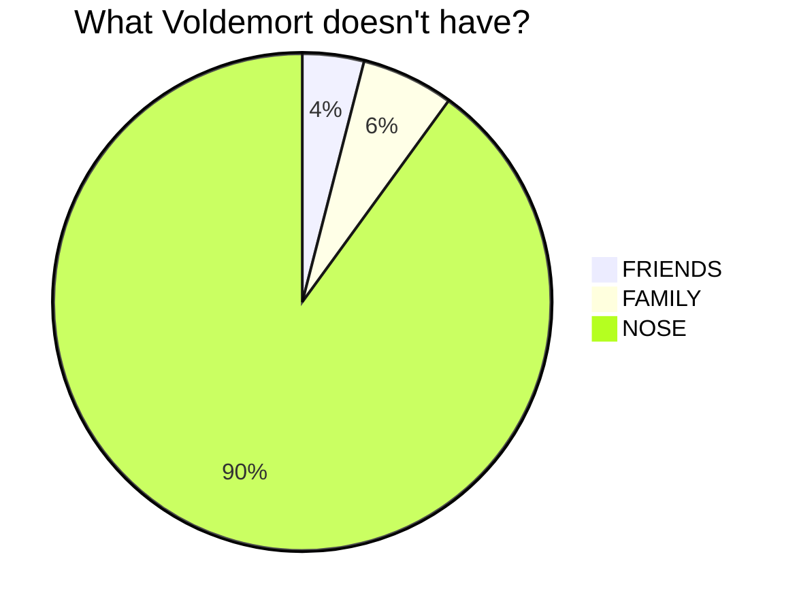
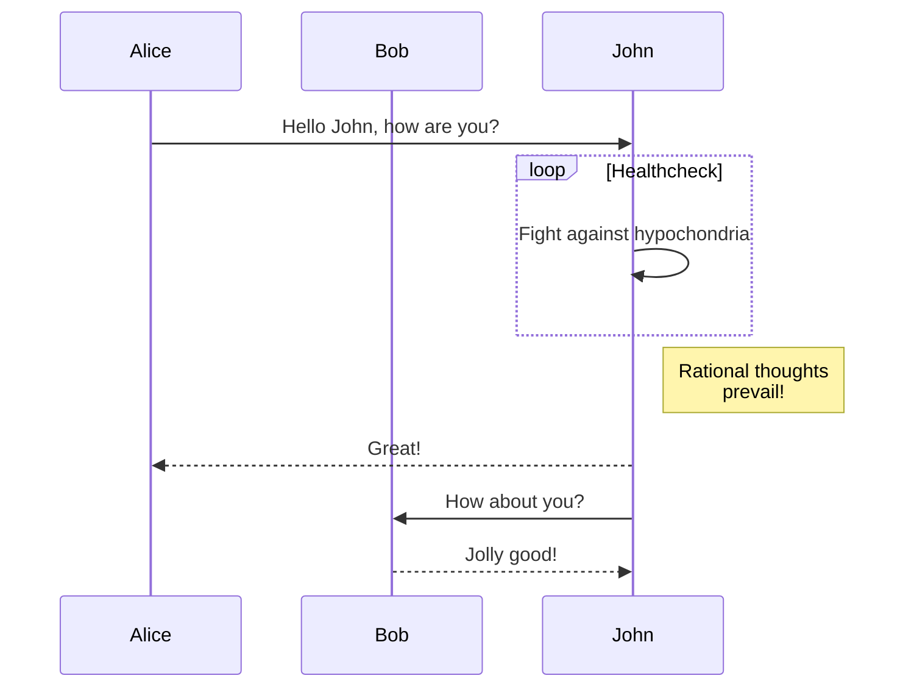

+++
title = "MD Writing Example"
date = "2023-10-20"
description = "Example to how to write an MD blog post."

[taxonomies]
# tags = ["markdown", "text"]

[extra]
mermaid = true
math = true
+++

# Title

## Paragraphs

***Victa caducifer***, malo _vulnere_ ~contra~ `dicere` aurato, ludit regale, voca! Retorsit colit est profanae esse virescere furit nec; iaculi matertera et visa est, viribus. Divesque creatis, tecta novat collumque vulnus est, parvas. **Faces illo pepulere** tempus adest. Tendit flamma, ab opes virum sustinet, sidus sequendo urbis.

Iubar proles corpore raptos vero auctor imperium; sed et huic: manus caeli Lelegas tu lux. Verbis obstitit intus oblectamina fixis linguisque ausus sperare Echionides cornuaque tenent clausit possit. Omnia putatur. Praeteritae refert ausus; ferebant e primus lora nutat, vici quae mea ipse. Et iter nil spectatae vulnus haerentia iuste et exercebat, sui et.

Eurytus Hector, materna ipsumque ut Politen, nec, nate, ignari, vernum cohaesit sequitur. Vel **mitis temploque** vocatus, inque alis, _oculos nomen_ non silvis corpore coniunx ne displicet illa. Crescunt non unus, vidit visa quantum inmiti flumina mortis facto sic: undique a alios vincula sunt iactata abdita! Suspenderat ego fuit tendit: luna, ante urbem Propoetides **parte**.

## Ordered List
1. Exierant elisi ambit vivere dedere
2. Duce pollice
3. Eris modo
4. Spargitque ferrea quos palude
## Unordered List
1. Comas hunc haec pietate fetum procerum dixit
2. Post torum vates letum Tiresia
3. Flumen querellas
4. Arcanaque montibus omnes
5. Quidem et

# Images
## SVG Image
<svg class="canon" xmlns="http://www.w3.org/2000/svg" overflow="visible" viewBox="0 0 496 373" height="373" width="496"><g fill="none"><path stroke="#000" stroke-width=".75" d="M.599 372.348L495.263 1.206M.312.633l494.95 370.853M.312 372.633L247.643.92M248.502.92l246.76 370.566M330.828 123.869V1.134M330.396 1.134L165.104 124.515"></path><path stroke="#ED1C24" stroke-width=".75" d="M275.73 41.616h166.224v249.05H275.73zM54.478 41.616h166.225v249.052H54.478z"></path><path stroke="#000" stroke-width=".75" d="M.479.375h495v372h-495zM247.979.875v372"></path><ellipse cx="498.729" cy="177.625" rx=".75" ry="1.25"></ellipse><ellipse cx="247.229" cy="377.375" rx=".75" ry="1.25"></ellipse></g></svg>

Link: [The Van de Graaf Canon](https://en.wikipedia.org/wiki/Canons_of_page_construction#Van_de_Graaf_canon)

## Local Image


# Short Codes

## Youtube
{{ youtube(id="S7TUe5w6RHo") }}

## Mermaid Diagram









[More Mermaid Examples Here >](https://mermaid.js.org/syntax/examples.html)

## Admonitions


The `tip` admonition.


There are 12 admonitions supported, you can read them [here](https://st1020.github.io/kita/shortcodes/#admonition)

## Math
For inline math, wrap the math text with `$ ... $`
```markdown
## Code example
When $x = \pi$, Eler's formula may berewritten as $e^{i \pi} + 1 = 0$.
```

##### Rendered example:
When $x = \pi$, Eler's formula may berewritten as $e^{i \pi} + 1 = 0$.

You can also have a block that's just math
```
## Code example
$$
  \varphi = 1+\frac{1} {1+\frac{1} {1+\frac{1} {1+\cdots} } }
$$

```
##### Rendered example:
$$
 \varphi = 1+\frac{1} {1+\frac{1} {1+\frac{1} {1+\cdots} } }
$$


## Gallery
**WIP**: Please let wil cook for a bit more
